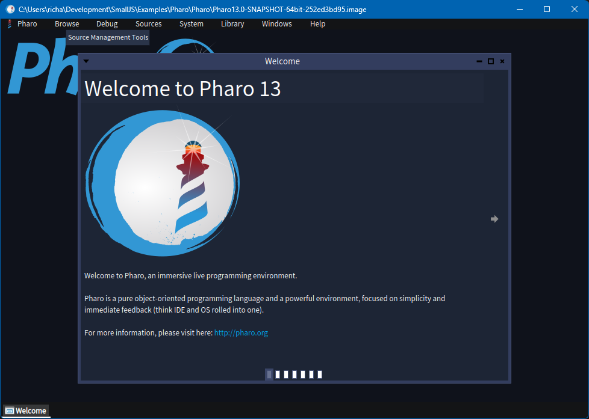
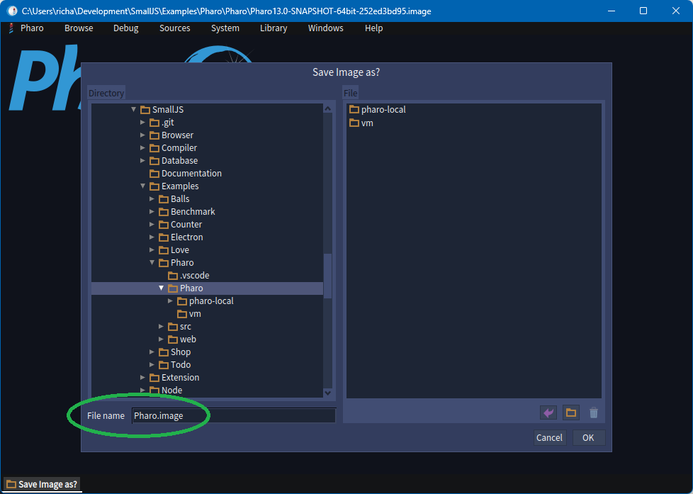
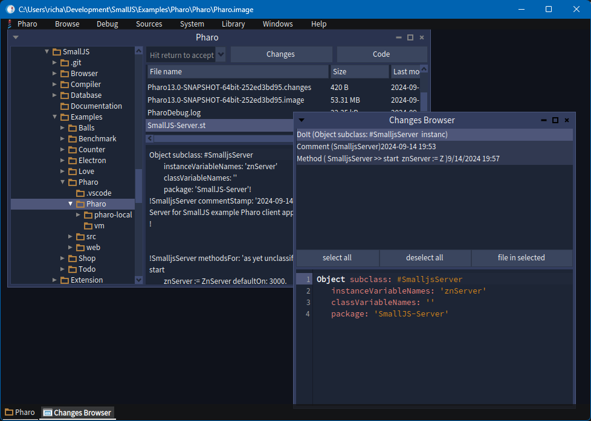
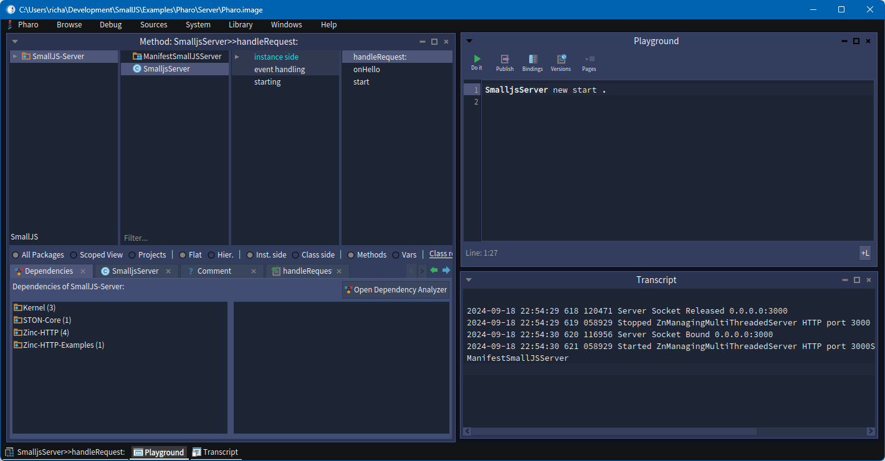

  

# Pharo server example

This will help you:
- Download and install Pharo.
- Setup Pharo windows for development and monitoring.
- Startup the SmallJS Pharo example server.

Note: If you already have Pharo running, \
you can skip the installation steps and go the paragraph:\
`Installing the SmallJS example app`

## Downloading & installing Pharo (MacOS)

2024-09-23:
Pharo currently crashes on the latest standalone VM and image on my (older) Intel MacOS Monterey.\
Alternatively, you install Pharo  with the Pharo Launcher.\
But then the app and image will be stored outside the repo folder.\
Be sure to set the correct paths in the file: `/Examples/Pharo/Server/.env`

And if you change the Pharo package `Smalljs-Server`,\
after `fileOut`, remember to copy it back to the source folder.

## Downloading & installing Pharo (Windows and Linux)

"Pharo standalone" can be downloaded at the bottom of this page:
> [https://pharo.org/download](https://pharo.org/download)

### Installing the images

First download the zipped standalone version of the Pharo image.\
It will have a name like: `latest-64.zip`\
Extract it to the SmallJS repo folder:
> `Examples/Pharo/Server`

Download the zipped standalone version of the Pharo VM.\
It will have a name like: `pharo-vm-Windows-x86_64-stable.zip`\
Extract it to the SmallJS repo folder:
> `Examples/Pharo/Server/vm`

## Setting up Pharo

Now Pharo can be started from the VM folder: `Examples/Pharo/Pharo/vm`\

On Windows:\
The executable it is named: `Pharo.exe`\
Now the dialog `Select Pharo image to open` appears.\
Select the Pharo image previously extracted to the parent folder.\
It will have a name like: `Pharo13.0-SNAPSHOT-64bit-252ed3bd95.image`

On Linux:\
Linux does not show a file open dialog for the image.
You will have to open a terminal and start `./vm/pharo` 
with the exact Pharo image filename, see example above.

Now the Pharo Welcome screen should be displayed:

You can now close the Welcome window.

Now save a copy of the image with the standard name `Pharo.image`,\
with the menu selection `Pharo | Save As...`

Now look at the file `/Examples/Pharo/Server/.env`
Uncomment and possibly edit the lines for setting the environment variables:
`pharoVm`, `pharoImage`, `pharoWeb`.
On Windows and Linux, the values will be oke for the standalone setup.\
On MacOS, you will have to change the variable paths.

Pharo can now be conveniently started on the image with the script:
> `Examples/Pharo/Server/start.sh`

## Installing the SmallJS example app

Open the Pharo file browser with menu: `System | File Browser`\
Navigate to the Smalltalk source file: `Examples/Pharo/Pharo/SmalljsServer.st`\
Right-click on the file and choose menu option: `Change-list browser`\
Click the button: `select all`\
The click the button 'file in selected'

It will look something like this:

Now these two windows van be closes.

## Setting up Pharo windows for development

Open the following 3 Pharo windows:

### System Browser for browsing and changing code

Open a Pharo System Browser with menu: `Browse | System Browser`\
In Package window pane (top left), in the Filter section at the bottom type `SmallJS`.\
Click on the `SmallJS-Server` package found.\
Now you can select classes, categories and methods in the package.\
Move this window to the left half of the screen.

Pharo has a built-in webserver called `Zinc`.\
Here is a link to documentation for it on pharo.org:
[2020-03-23-Zinc.pdf](https://books.pharo.org/booklet-Zinc/pdf/2020-03-23-Zinc.pdf)

### Playground for starting the app

Open a Pharo Playground with menu: `Browse | Playground`\
Move this window to the upper-right quadrant of the screen.\
Copy-paste in this text for stating the app, but don't run it yet:  `SmalljsServer new start'`

### Transcript for viewing the webserver log

Open a Pharo Transcript with menu: `Browse | Transcript`\
Move this window to the lower-right quadrant of the screen.\
Here the log messages of the Zinc web server will be shown.

### Running the Pharo server

In the Playground window, right-click on the line: `SmalljsServer new start`
and select "Do It".\
You should now see logging messages form the web server in the Transcript window.

### Check the result and save your image

The result should look something like this:

Important: Now **save** your image with menu: `Pharo | Save`

## Running example Pharo client

Now you can start the Pharo client app with this help:
[PharoClient.md](../Client/PharoClient.md)

