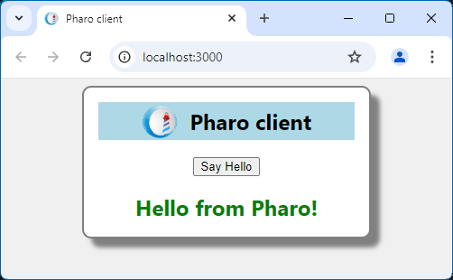

# Pharo example client

The Pharo client is a standard SmallJS browser app\
that communicates to the Pharo server using a web standard API.

The static HTML files for the client app are hosted by the Pharo Server.\
And there one web API request `/hello` done to the server and the result is shown.

So the Pharo sever setup is equivalent to a SmallJS Node.js / Express server app.

## Starting the Pharo server

First make sure the Pharo server is set up and running first.
To set it up, check out: [PharoServer.md](../Server/PharoServer.md)
If it's set up already, you can start it with: `startServer.sh`

## Starting the SmallJS Pharo client

Open the VSCode workspace `PharoClient.code-workspace`\
Press [F5] to start the client in debug mode.\
Press the "Say Hello" button to request a response from the Pharo server.

The result should look like this:

