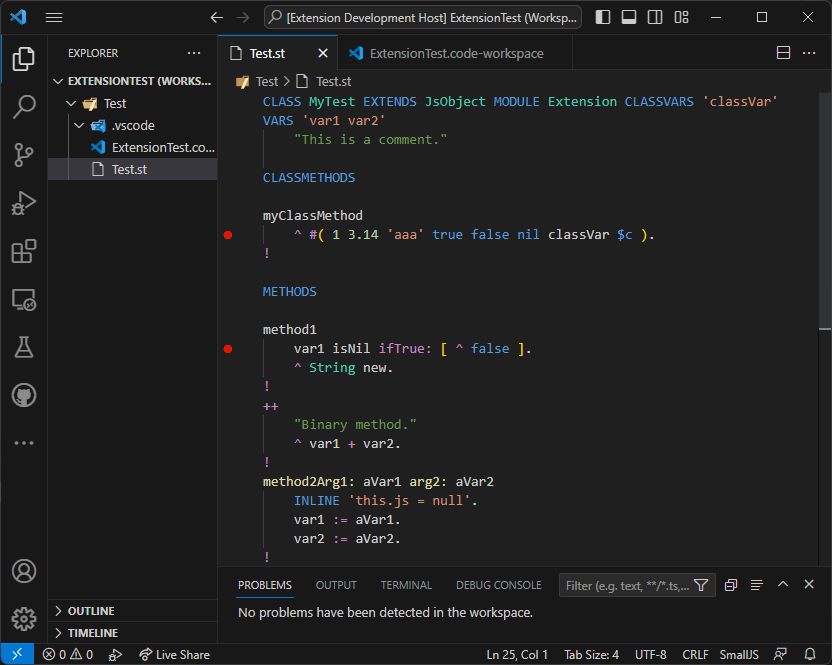

# SmallJS VSCode extension

The SmallJS VSCode extension provides syntax coloring
and debugging (breakpoint) support when developing in SmallJS.

## Features

This is how it looks in action:

## Requirements

To enable the extension globally run the script: `deploy.sh`

## Extension Settings

None.

## Known Issues

Unary method names have the same color as variables.
Breakpoints can only be set on lines with method calls.

## Release Notes

### 1.0.0

Initial release.
