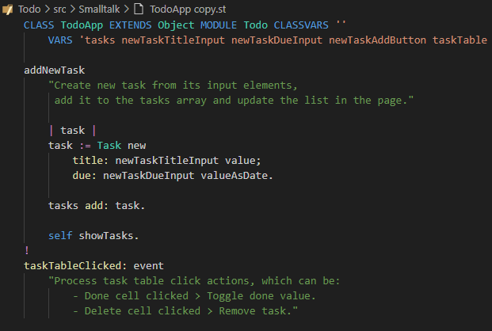

# SmallJS README

	
	 
	<label>Official website: </label>
	<a href="https://small-js.org" style="font-weight: bold;">small-js.org</a>

## News - SmallJS Tutorial core part complete - 2-FEB-2025

The SmallJS website has a tutorial page for learning SmallJS and Smalltalk.\
The link is: [small-js.org/Tutorial](https://small-js.org/Tutorial) .\
It is now complete for the core language and library classes.\
The tutorial can done interactively by using the online [Playground](https://small-js.org/Playground) .\
If you have any feedback for wishes for the tutorial,\
please create an issue in the website repo: [github.com/Small-JS/Website/issues](https://github.com/Small-JS/Website/issues) ,\
or mail to info at small-js.org.

Happy learning and playing!

## News - SmallJS class Reference available - 23-DEC-2025

The full class documentation is now available on the website: [small-js.org/Reference](https://small-js.org/Reference) .

## News - SmallJS v1.9 committed - 13-NOV-2025

The latest commits now give SmallJS full support for async, await and promises!\
Almost async calls classes have been converted form callbacks to use promises,\
making calling code cleaner, more concise and easier to debug.\
Check out [Async.md](./Documentation/Language/Async.md) for usage instructions.

## Introducing SmallJS

SmallJS is a free and open source implementation of the elegant and powerful Smalltalk-80 (ST) language.\
It compiles to JavaScript (JS) that runs in modern browsers or in recent Node.js.\

SmallJS is file based, not image based, so you can develop in your favorite IDE.\
The default setup is for Visual Studio Code, with ST syntax coloring and step-debugging!\
You code separately from the SmallJS base libraries (image).\
Only the parts you use are imported automatically when running your app.

SmallJS is _fully_ object oriented, so customizable on every level.\
For usability, ST class and method names are kept mostly equal to their familiar JS counterparts.

JS libraries already encapsulated in ST are:

- Browsers: Document, Window, HTML elements, events, CSS, streams.
- Node.js: HTTP server, Express, file mgmt, 3 databases, 5 AI providers.
- Desktop apps: NWjs, Electron, NodeGui.

To get you started quickly, there are several example projects using the above.

## Code example

## Installing

To install SmallJS check out:
[Installing.md](Documentation/Installing/Installing.md)

## Examples

For a first impression of running SmallJS code, see the example projects:
[Examples.md](Examples/Examples.md)

## Playground

To get a feel for Smalltalk and to quickly test out ST expressions,
a playground is accessible though the offical website:
[small-js.org/Playground](https://small-js.org/Playground)

## Documentation

The complete SmallJS documentation, including a tutorial, is located here:
[Documentation.md](Documentation/Documentation.md)

## Contributions

Contributions to SmallJS that are not part of the main system.
but show interesting applications:
[Contributions.md](Contributions/Contributions.md)

