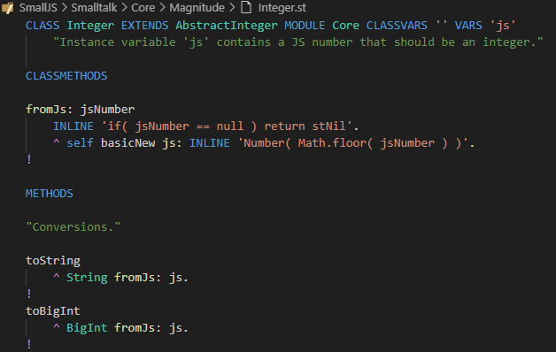

# SmallJS README

# What is SmallJS?

SmallJS is a compiler (transpiler) from the Smalltalk (ST) language to JavaScript (JS).
The generated JS code runs in all modern browsers or in Node.js.
SmallJS has full syntax support for the simple and elegant Smalltalk-80 language.

SmallJS is file based, not image based, so you can develop in your favorite IDE
The default setup is for Visual Studio Code, with ST syntax coloring and step debugging!

SmallJS is *fully* object oriented, so customizable on every level.
For usability, ST class and method names are kept mostly equal to their familiar JS counterparts.
JS libraries already encapsulated in ST are:
- Browser: Document, Window, HTML elements, events, CSS, streams.
- Node.js: HTTP server, Express, 3 databases.
- And an Example webshop client + server app template.

# Example

# Getting started

SmallJS is currently set-up for use with Visual Studio Code, but other IDEs could be added.
For the back-end, Node.js is the framework of choice, also using Express.
Databases Postgres, MariaDB and MySQL are supported out of the box.

## Prerequisites

To install all the prerequisites, look at:
>[./Documentation/Installing.md](./Documentation/Installing.md)

## Compiler

First the compiler needs to be built.
To do that open this workspace in VSCode: `./Compiler/Compiler.code-workspace` .
TS to JS compilation should start automatically.
Maybe you need to install the TS types for Node.js with: `npm install -g typescript@latest`
To install npm dependencies type `npm install in a terminal`.
You cannot run the compiler yet, because it's 'unit test' project `./Node` has not been built yet.
(And `./Node` needs a working compiler, it's a bit of a catch-22 situation)

## Node

Now open this workspace in VSCode: `./Node/Node.code-workspace` .
To install npm dependencies type `npm install` in a terminal.
Now run the project and see that unit tests are performed succesfully.
See more info in:
> [./Node/Node.md](./Node/Node.md)

## Browser

For a first impression of running SmallJS code in a browser, you can start the Browser test project, see:
>[./Browser/Browser.md](./Browser/Browser.md)

# Documentation

The complete documentation is indexed here:
>[./Documentation/Documentation.md](./Documentation/Documentation.md)
