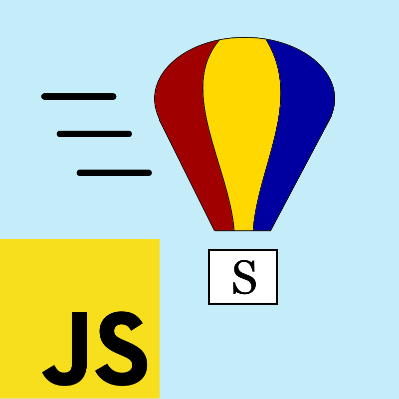
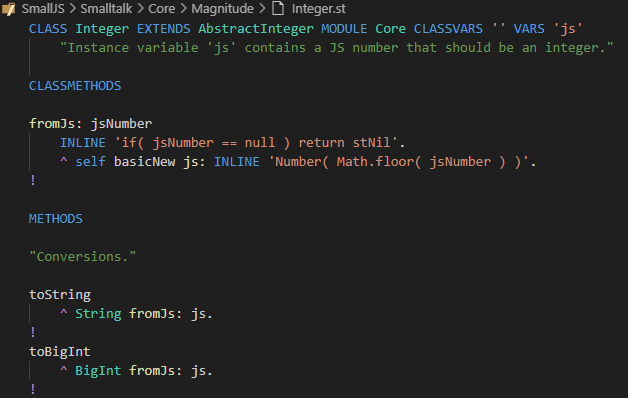

# SmallJS README

	
	 
	<label>Official website: </label>
	<a href="https://small-js.org" style="font-weight: bold;">small-js.org</a>

## Introducing SmallJS

SmallJS is a free and open source implementation of the elegant and powerful Smalltalk-80 (ST) language.
It compiles to JavaScript (JS) that runs in modern browsers or in Node.js.

SmallJS is file based, not image based, so you can develop in your favorite IDE.
The default setup is for Visual Studio Code, with ST syntax coloring and step debugging!
You code separately from the SmallJS base libraries (image) and only the parts you use are imported automatically when running your app.

SmallJS is _fully_ object oriented, so customizable on every level.
For usability, ST class and method names are kept mostly equal to their familiar JS counterparts.

JS libraries already encapsulated in ST are:

- Browsers: Document, Window, HTML elements, events, CSS, streams.
- Node.js: HTTP server, Express, 3 databases, files.

To get you started quickly, there are several example projects.

## Code example

## Getting started

SmallJS is currently set-up for use with Visual Studio Code, but other IDEs could be added.
For the back-end, Node.js is the framework of choice, also using Express.
Databases SQLite, Postgres, MariaDB and MySQL are supported out of the box,
where SQLite is built into Node.js de can be used right away.

## Install prerequisites

To install all the prerequisites, look at:
>[./Documentation/Prerequisites.md](./Documentation/Prerequisites.md)

## Install NPM modules

Now run the bash script `./install.sh`.
On Windows, the `.sh` extension should be associated with Git Bash once.
Do this by clicking on the file in the explorer and then choose open with Git Bash always.

This script:
- Checks if the prerequisites are present.
- Installs the SmallJS language extension in VSCode.
- Installs NPM modules for all Node.js projects.

## Build and test SmallJS projects

Run the bash script: `./build.sh`, that:
- Builds the Smalltalk to JS `./Compiler`.
- Builds the core ST projects and runs their unit tests.

Notes:
- Browser GUI testing is disabled by default. To enable it, check out:
  > [./Documentation/Building.md](./Documentation/Building.md)

Check if everything builds tests successfully before going to the next step.

## Example projects

For a first impression of running SmallJS code, see the example projects:
>[./Examples/Examples.md](./Examples/Examples.md)

## Playground

To get a feed for Smalltalk and to quickly test out ST expressions.
There's a browser based playground to compile and evaluate them in real-time.
Check for more info, read:
>[./Playground/Playground.md](./Playground/Playground.md)

The playground is also accessible though the offical website
>[small-js.org/Playground/Playground.html](https://small-js.org/Playground/Playground.html)

## Documentation

The complete documentation is located here:
>[./Documentation/Documentation.md](./Documentation/Documentation.md)
