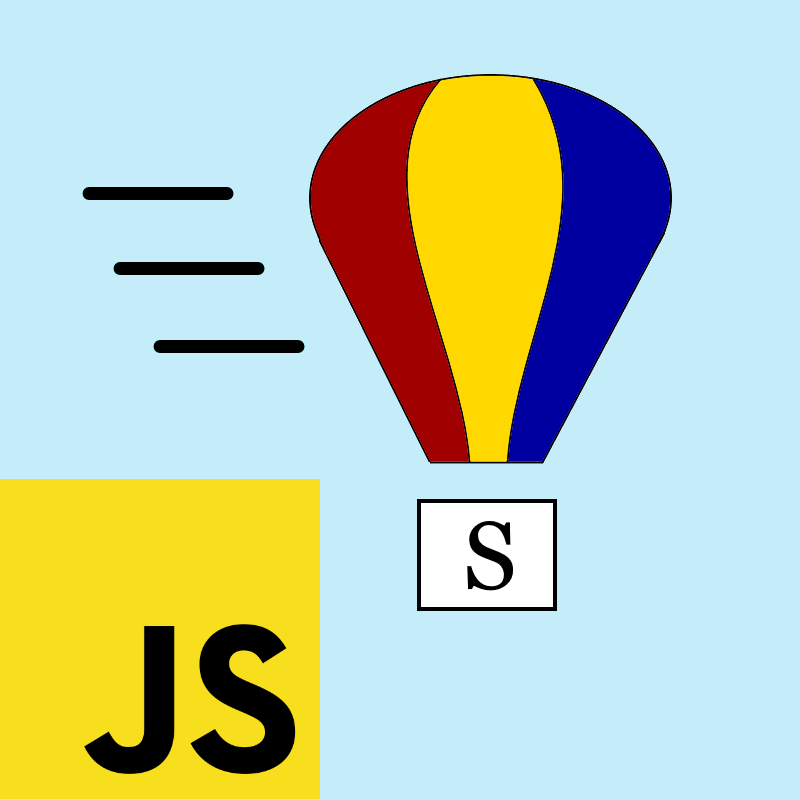
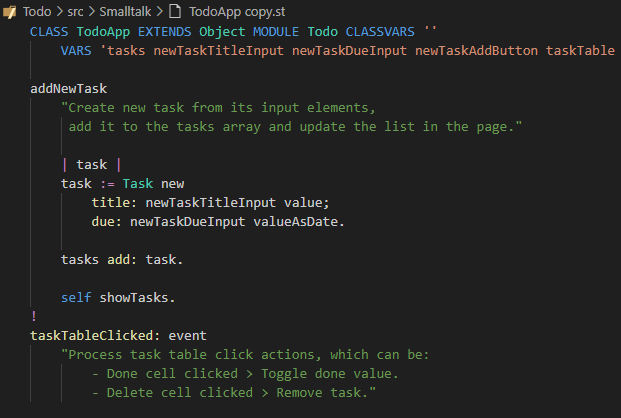

# SmallJS README

	
	 
	<label>Official website: </label>
	<a href="https://small-js.org" style="font-weight: bold;">small-js.org</a>

## News - SmallJS 2.1 released ! - 13-MAY-2026

### Compiler

- New keyword `CLASSEXTENSION` for adding methods to (system) classes\
  in separate source files.
  The website Tutorial page Language/Syntax shows how to use it.

### Smalltalk

- Database: Standardized SQL syntax for simpler database independent queries.

### Examples

- Added PWA example game: Emoji Memory :-).\
  Also added this example app to this webite.

### Website

- New Tutorial section for making Node.js apps with SmallJS,\
  plus new Tutorial section for making desktop apps with SmallJS\
  using NW.js, Electron or NodeGui.
- Reference page now supports searching classes and methods.
- Added dark mode option, also for subsites Reference and Tutorial.
- Updated Playground evaluator to current compiler.

## Introducing SmallJS

SmallJS is a free and open source implementation of the elegant and powerful Smalltalk-80 (ST) language.\
It compiles to JavaScript (JS) that runs in modern browsers or in recent Node.js.\

SmallJS is file based, not image based, so you can develop in your favorite IDE.\
The default setup is for Visual Studio Code, with ST syntax coloring and step-debugging!\
You code separately from the SmallJS base libraries (image).\
Only the parts you use are imported automatically when running your app.

SmallJS is _fully_ object oriented, so customizable on every level.\
For usability, ST class and method names are kept mostly equal to their familiar JS counterparts.

JS libraries already encapsulated in ST are:

- Browsers: Document, Window, HTML elements, events, CSS, streams.
- Node.js: HTTP server, Express, file mgmt, 5 databases, 5 AI providers.
- Desktop apps: NWjs, Electron, NodeGui.

To get you started quickly, there are several example projects using the above.

## Code example

## Installing

To install SmallJS check out:
[Installing.md](Documentation/Installing/Installing.md)

## Examples

For a first impression of running SmallJS code, see the example projects:
[Examples.md](Examples/Examples.md)

## Playground

To get a feel for Smalltalk and to quickly test out ST expressions,
a playground is accessible though the offical website:
[small-js.org/Playground](https://small-js.org/Playground)

## Documentation

The complete SmallJS documentation, including a tutorial, is located here:
[Documentation.md](Documentation/Documentation.md)

## Contributions

Contributions to SmallJS that are not part of the main system,
but show interesting applications:
[Contributions.md](Contributions/Contributions.md)

