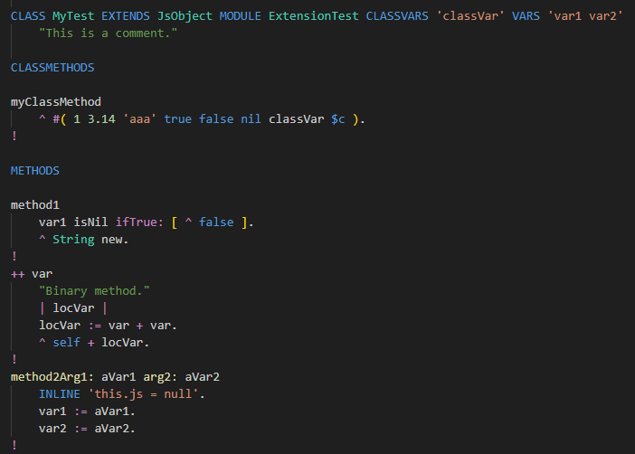

# ./Smalltalk folder

The main Smalltalk source code of the system, for both the Node.js and browser environments and classes shared by both.

Subfolders in this folder:
- Core - Common ST classes for browser and Node environments
- Browser - Browser specific classes, mainly the DOM.
- Node - Node.js specific classes for, creating server apps.
- AI - Classes for creating AI apps.
- NWjs - Classes for creating NW.js desktop apps. (recommended)
- Electron - Classes for creating Electron desktop apps.
- NodeGui - Classes for creating NodeGui desktop apps.

Every class is implemented in a separate *.st file.
Further subfolders are used to group classes logically,
but their location does not affect their use because all classes are global variables.

Classes are grouped in modules, that are implemented using JS (ECMAScript) modules.
This limits the number of JS files that are generated with compilation and allows for circular class references between classes in the same modules.

## Smalltalk syntax

Here's an example SmallJS class declaration.

Explanation of syntax used:

- `CLASS` : Is followed by the class name.

- `EXTENDS` : Indicates the base class. `Object` is the root class.
- `MODULE` : The JS module this class should be put in.
- `CLASSVARS` : Variables of the class itself (not its instances). Like JS static class vars.
- `VARS` : Instance variables of objects created from the class, e.g.: `MyTest new`.
- `"This is a comment ..."` : Comments are put in double quotes.
- `CLASSMETHODS` : Following methods will be added to the (meta)class, like JS static class methods.
- `METHODS` : Following methods will be added to class **instances**, like JS regular class methods.\
  (Is the default method type if neither `CLASSMETHODS` nor `METHODS` is specified.)
- Message sending types, ordered from highest to lowest evaluation precedence:
	- `method1` : Unary method, has no arguments.
	- `++ var` : Binary (operator) method, has one argument.
	- `method2Arg1: aVar1 arg2: aVar2` : Keyword method, has one or more arguments.
- `| locVar lv2 lv3 |` : Local variables declaration.
- `!` : End of method
- Constants
	- `'aaa'`: String, uses single quotes
	- `1` : Integer
	- `3.14` : Float
	- `true`, `false`: Boolean
	- `nil` : Nil singelton, like JS `null`.
	- `$c` : Character
- `var1 := 3` : variable assignment
	- `var1 = 3` tests for equality.
- `^ 42` : Return a value.
- `#( 1 3.14 'aaa' )` : array with 3 values.
- `[ 1 + 2 ]` : block, like JS lambda functions.
	- `[ :a | :b | ^ a + b ]` : block with 2 arguments returning sum from **method** (not block).
- `INLINE` : Inline JS code, not transpiled.\
  ST variables can be accessed in it using the same name
- Control flow statements in ST use messages and blocks from above.
	- `1 + 2 = 3 ifTrue: [ 'Checks out' ]`\
	  Like JS: if( 1 + 2 == 3 ) { ... }
	- `a > 0 ifTrue: [ 'Positive' ] ifFalse: [ 'Zero or negative' ]`\
	  Like JS: if( a > 0 ) { ... } else { ... }
	- `1 to: 10 do: [ :n | self log: n ]`\
	  Like JS: for( n = 1; n <= 10; ++n ) { ... }
	- `[ a > 0 ] whileTrue: [ self log: a. a decrement ]`\
	  Like JS: while( a > 0 ) { ... }
	- `[ self log: a. a decrement ] doWhile: [ a > 0 ]`\
	  Like JS: do { ... } while( a > 0 )
